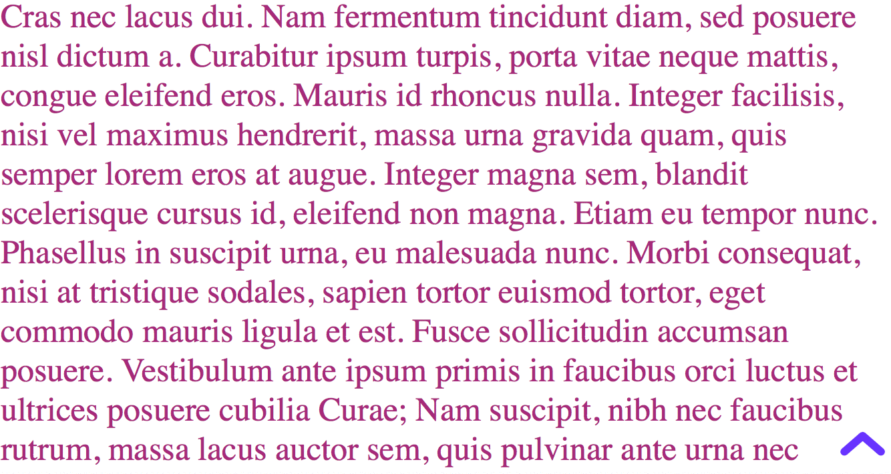

# React Scroll2TopButton component
> A react component that renders a scroll-to-top button.

### Demo
<p align="center">
  
</p>

### Usage

    npm install react-scroll2top-button

> In your .jsx

```javascript
import React, { Component } from 'react';
import Scroll2TopButton from 'react-scroll2top-button';

export default class App extends Component {
  render() {
    return (
    // Add your component markup and other subcomponent references here.
      <div>
        <h1>Hello, World!</h1>
        <h1>Hello, World!</h1>
        <h1>Hello, World!</h1>
        ...
        <Scroll2TopButton />
      </div>);
  }
}

```

### Properties

| Property       |              Description              |  Type  | Required |
|----------------|:-------------------------------------:|:------:|:--------:|
| delay      |   scrolling with [delay]ms delay  | number |    NO    |
| scrollStep | scrolling per [scrollStep] pixels | number |    NO    |
| color          |              button color             | string |    NO    |

### Example

```
npm install
npm start
Open http://localhost:5000
```

### Linting

ESLint with React linting options have been enabled.

```
npm run lint
```

### Credits
Big thanks to [react-es6-webpack-boilerplate](https://github.com/vasanthk/react-es6-webpack-boilerplate), which provided the base of this project and of course gave me the chance to have a very first viewing on the latest front-end configurations.
